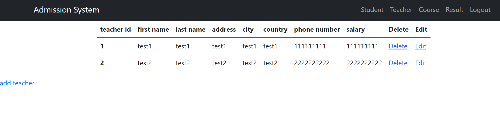
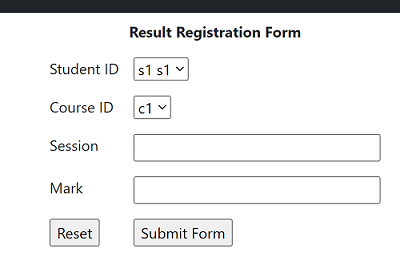

# AdmissionSystem
This is a AdmissionSystem webapplication with Spring boot framwork, and Hibernate object-relational mapping with database.
It also has permission based login with spring security framwork.


## Install

### Dependencies

You need following:

-Java
-maven
-Relational Database
-Servlet container(optional)


### Install repo and requirements

after installing your database ( I used postgresql ) modify application.properties file base on your database.


after installing maven you can download application library and compiling program by

```bash
$ mvn clean install
```

## Demo

### Test Inference

You can test the the app with running AdmissionSystemApplication.

Or you can get package.

```bash
$ mvn package
```

You can try to login with three registered user student, teacher, ar(admin).
each one has their own permissions.

First you need to login

Here you can see studnet, teachers, courses, and result tables.
you can also add, delete, and modify them by clicking on the link.







## Future

In the next version, you will be able to register username throw webApplication and verify your email by clicking on verification email that it sends you.

Moreover, please feel free to give us your feedback to share your experience.

# Contact Me


LinkedIn: https://www.linkedin.com/in/arian-sadeghi-469696241

GitHub: https://github.com/Ariangca